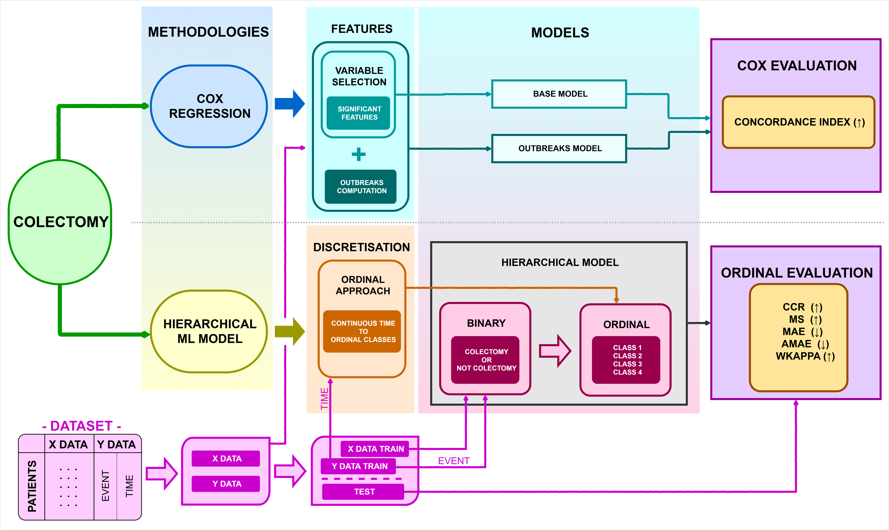

# Colectomy survival models:   From Cox regression to ordinal classification
This repository was created with the aim of sharing the code used for the experimentation of my Master's Final Project.   

The diagram below shows the process of the two methodologies developed in this project.
  * Cox Regression Model, the experimentation of which is shown in file [ColectomyCoxRegressionModel.py](ColectomyCoxRegressionModel.py)
  * Proposed Hierarchical Model, the experimentation of which is shown in file [ColectomyHierarchicalModel.py](ColectomyHierarchicalModel.py)
  

